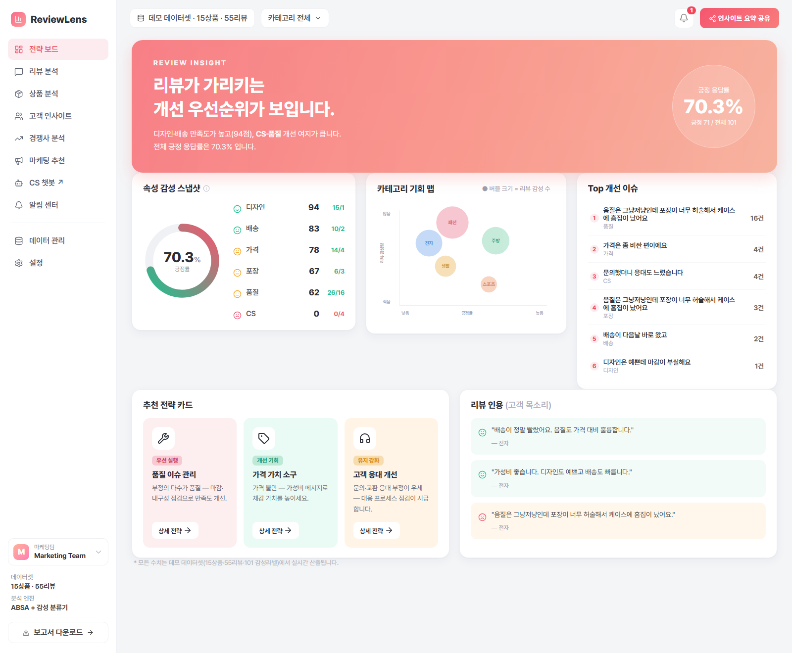
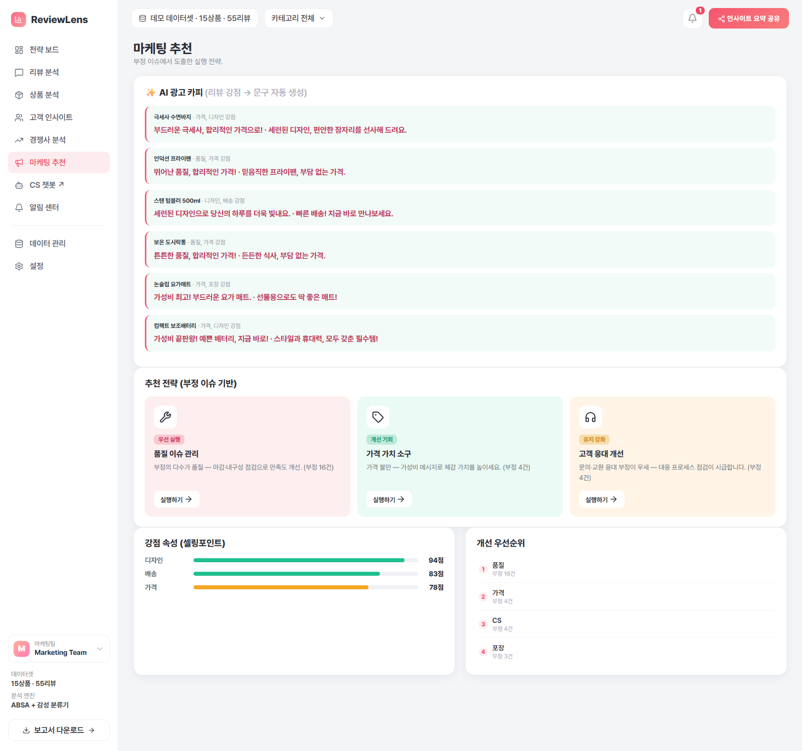
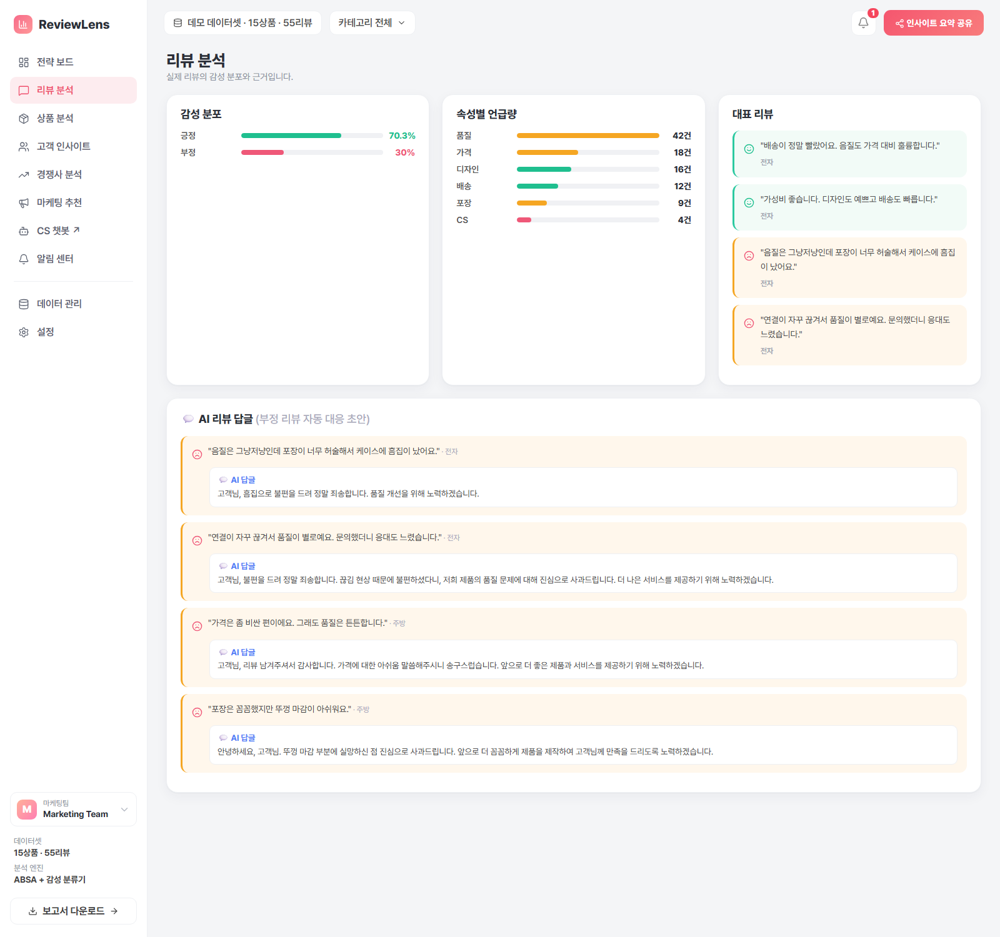
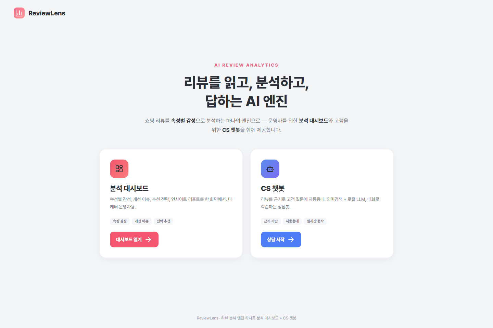
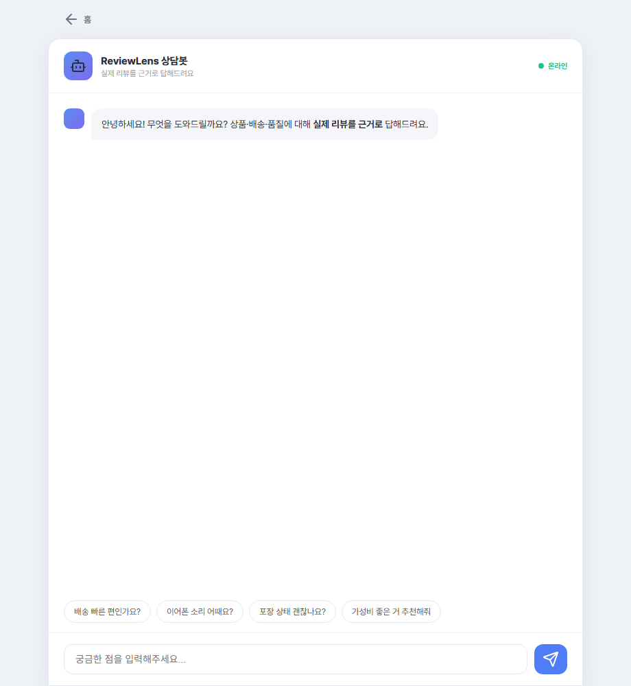

# ReviewLens

> **쇼핑 리뷰를 분석해 마케팅 실행안(광고 카피·개선 우선순위·리뷰 대응)을 자동으로 뽑아주는 AI 도구 — ML·백엔드·프런트·배포까지 풀스택 직접 구현.**

**제작: 최동윤** · 광고·마케팅 도메인 **풀스택 개발자** 포트폴리오

[](https://huggingface.co/spaces/dongyuns/reviewlens)


| | |
|---|---|
| 👤 **담당** | 기획 · UI/UX · Frontend · Backend · ML 파이프라인 · DB 설계 · 배포 — **100% 단독 구현** |
| 📅 **기간** | 2026.06.01 ~ 06.12 (약 2주 · 1인 개발) |

> **한 줄 결과** — 실제 네이버 리뷰 **3,000건** 자동 분석(별점 일치 87.2%) · **AI 광고카피·리뷰답글 자동 생성** · 실시간 VOC 대시보드 · **CPU 단독 배포**(외부 API 비용 0).

리뷰 수백 개를 사람이 다 못 읽습니다. ReviewLens는 리뷰를 **속성별 감성(ABSA)** 으로 분석해, 마케터가 *바로 쓰는 결론* — **강점→광고 카피**, **약점→개선 우선순위·대응 답글**, **속성별 평판→대시보드** — 으로 바꿔줍니다.

이 포트폴리오의 핵심은 *기능 개수*가 아니라 **전 계층을 혼자 구현**했다는 점입니다. 리뷰 한 줄이 **ML 분석 → 저장소 → API → Vue 웹 → 배포**까지 흐르는 end-to-end 파이프라인을 데이터·백엔드·프런트·DevOps 전 영역에서 직접 만들었고, 전 과정 **CPU 전용**(로컬 Ollama 추론)으로 외부 API 비용 0.

> **🎯 마케팅·광고 개발 직무 관점:** 리뷰는 *소재*일 뿐, 증명하는 역량은 **"비정형 데이터 → 마케팅 의사결정·실행(광고 카피·우선순위·대응)" 파이프라인을 풀스택으로 만든다**는 것입니다. 같은 구조(수집→분석→인사이트→자동 산출물)는 **광고 성과·캠페인 데이터에도 그대로 전이**되며, **VOC 분석 · 크리에이티브 자동화 · 마케터용 대시보드** 등 마케팅 도구 개발에 바로 쓰이는 스킬셋을 한 프로젝트로 보여줍니다.

---

## 데모 화면

> ▶️ **라이브 배포**: [`DEPLOY.md`](DEPLOY.md) 참고 — Hugging Face Spaces(무료 CPU)에 Docker로 배포. Ollama 없이도 **대시보드 전체 + 챗봇 즉답**이 동작합니다.

**분석 대시보드** (`/dashboard`) — 속성 감성·개선 이슈·전략 카드를 **실데이터로 실시간 산출**:



**AI 마케팅 카피** (`/dashboard#market`) — 리뷰 강점(디자인 94%·배송 83% 등)을 **광고 문구로 자동 생성**. 인사이트를 마케팅 산출물로:



**AI 리뷰 답글** (`/dashboard#review`) — 부정 리뷰마다 정중한 판매자 답글 초안을 자동 생성(평판관리 자동화):



| 랜딩 (`/`) | 인사이트 챗봇 (`/cs`) |
|---|---|
|  |  |

> 대시보드의 모든 수치(긍정률 70.3%·속성 점수·기회 맵·Top 이슈·전략 카드)는 데모 데이터셋(15상품·55리뷰)에서 `/api/board`로 **실시간 집계**됩니다 — 하드코딩 목업이 아닙니다.
>
> 액션 버튼도 실데이터로 동작합니다 — **보고서 다운로드**(속성 만족도·개선 이슈를 담은 `.txt` 인사이트 리포트 생성), **인사이트 요약 공유**(강점·개선·최다이슈를 클립보드로 복사), 전략 카드·알림 종은 해당 탭으로 딥링크. (인증이 없는 계정·카테고리 영역은 정직하게 비대화형 표시)

---

## 한눈에 보기

| 항목 | 내용 |
|---|---|
| 한 줄 소개 | 리뷰 → 마케팅 실행안(광고카피·개선우선순위·대응)을 자동으로 뽑는 AI 도구 · ML~프런트~배포 풀스택 직접 구현 |
| 포지션 | **광고·마케팅 도메인 풀스택 개발자** 포트폴리오 (도메인=마케팅 가치, 역량=전 계층 단독 구현) |
| 핵심 기술 | ABSA(속성별 감성 분석), 협업필터링+감성 하이브리드 추천, 의미검색 RAG 챗봇, 마케팅 자동화(AI 광고 카피·리뷰 답글) |
| 스택 | **프런트** Vue 3 + Vite · **백엔드** Python · FastAPI · SQLite/Postgres · KoELECTRA · Ollama(gemma3:4b 챗봇·gemma4:12b 요약·qwen2.5:3b ABSA) · implicit(ALS) · ko-sroberta+FAISS |
| 실행 환경 | CPU 전용 (torch CPU 휠 + 로컬 LLM) |
| 성과 | ABSA F1 0.93(gold 101), 추천 블렌딩 Recall@10 0.31(>popularity 0.19), 속성 학습(NIKL ACD micro-F1 0.66) |

> ⚠️ **데이터 규모(정직)**: ABSA *데모/gold*는 **데모 데이터셋(15상품·55리뷰·gold 101, 단일 라벨러)** 기준이라, 절대 수치보다 *방법 간 비교·파이프라인 검증*이 목적이에요. **단, 핵심 컴포넌트는 실데이터로 검증**했습니다 — ABSA는 **실제 네이버 리뷰 3,000건에서 별점 일치도 87.2%**(`absa_real.py`), 감성 분류기는 **네이버 200k**(F1 0.914), 추천 CF 백본은 **MovieLens**로 교차검증. (추천 *블렌딩*만 합성)

---

## 시스템 아키텍처 (데이터 흐름)

```
리뷰 → ABSA(속성별 감성) → 감성 저장소(SQLite) ┬→ 추천  (감성을 점수·설명에 반영)
                                                └→ 챗봇  (근거 리뷰로 답변)
```

리뷰 한 건이 들어오면 속성별(`배송·품질·가격·포장·디자인·CS`)로 감성을 분해해 SQLite에 적재합니다. 이 저장소가 추천과 챗봇의 공통 근거가 됩니다.

### 1. ABSA — 속성별 감성 분석 (3-way, 교체 가능)
- **규칙 + KoELECTRA**: 키워드 속성 추출 + 절 분리 + KoELECTRA 감성 (부트스트랩)
- **LLM (qwen2.5:3b)**: Ollama에 JSON 스키마를 강제해 `aspect / sentiment / evidence`를 구조화 추출
- **규칙 + 학습분류기**: 속성 추출은 규칙 공유, 감성만 도메인 학습 분류기(네이버쇼핑)로 교체 → **F1 0.92로 최고**
- 세 분석기를 같은 인터페이스(`analyze(text)`)로 두고 **gold 라벨로 F1 비교** (속성 추출 규칙은 `aspect_rules.py`로 공유)

### 2. 추천 — 협업필터링 + 감성 하이브리드
- **협업필터링(implicit ALS)**: user-item 상호작용에서 잠재요인을 학습해 개인화 추천
- **감성 블렌딩**: ABSA 감성 점수를 콘텐츠 신호로 섞어(`0.7·CF + 0.3·감성`) 정확도·설명력 강화
- **콜드스타트 fallback**: 상호작용이 없는 신규 유저는 감성 스코어러로 폴백 → `"배송 만족도 92%, 가격 만족도 80%"` 식 설명과 함께 추천
- **시간 기반 분할** 평가로 popularity 베이스라인과 비교 (랜덤 분할의 미래→과거 누수 회피)

### 3. 근거기반 챗봇 (의미검색 RAG + 자기개선)
- **의미검색**: 리뷰 원문을 ko-sroberta로 임베딩해 FAISS 인덱스로 만들고, 질문도 같은 공간에 임베딩해 **의미가 가까운 근거 리뷰**를 검색 (키워드 불일치도 검색)
- 검색된 리뷰(+속성 감성 라벨)를 프롬프트 근거로 넣어 LLM이 답변 → 근거 함께 반환
- **자기검증(self-check)**: 답하기 전 "근거에 충실한지" 모델이 스스로 판정해, 환각이면 재생성 (자동 오류 수정)
- **교정 메모리**: 사용자 👍/👎·정정을 저장하고, 다음에 **의미가 비슷한 질문**이 오면 그 정정을 근거보다 우선 주입 → *모델 재학습 없이* 대화로 즉시 개선 (모델 가중치를 안 건드려 catastrophic forgetting 없음)
- **한국어 보정**: 한자·코드스위칭 감지 시 삭제가 아니라 재생성으로 문법 보존
- **graceful fallback**: 의미검색은 LLM 없이도 동작 → Ollama 미가동 시에도 근거 리뷰를 반환

#### 응답 최적화 (CPU에서 즉답 서빙)
CPU 로컬 LLM은 신규 질문에 수~십수 초가 걸리므로, **실시간 경로에서 LLM 호출 자체를 최대한 제거**했습니다.
- **의도 라우팅 (17종)**: 질문을 분기 — *집계*("배송 어때?")·*추천*·*비교*·*장단점*·*특정상품+속성*·*상품목록*·*전체개요*·*인사/도움*에 더해, **마케팅 어시스턴트 답변**(*재구매 의향*·*개선 우선순위*·*강점/셀링포인트*·*광고 카피 추천*·*리뷰 답글 초안*)까지 **전부 리뷰 근거로 즉답**(LLM 생략). *특정 상품*은 **빌드 시 미리 생성한 요약**으로, 자유서술형만 실시간 RAG. 무관/난센스는 관련도 가드로 **안전 거절**. 답변마다 **처리 의도 배지**(예: "개선 우선순위 · 근거 6")를 표시해 *설계된 시스템*임을 노출.
- **상품 요약 사전계산**: 오프라인(빌드 시)에 상품별 자연어 요약을 `gemma4:12b`로 생성·저장 → 질의 시점 LLM 비용을 빌드 시점으로 이동. 품질 손실 없이 특정 상품 질문도 **<0.2초**.
- **답변 캐시 + FAQ 프리워밍**: 완전일치(dict)·의미유사(임베딩) 캐시로 반복/유사 질문 즉시 응답, 자주 묻는 질문은 서버 시작 시 백그라운드로 미리 데움.
- **모델 분리**: 라이브 챗봇 = 빠른 `gemma3:4b`, 오프라인 요약 = 고품질 `gemma4:12b`(thinking off로 한국어 보장), ABSA = `qwen2.5:3b`. 자유서술형(상품·속성 미특정) 질문만 실시간 LLM 사용.
- **백엔드 교체 가능**: 기본 Ollama, `RL_BACKEND=llamacpp`로 `llama-server` 직접 호출도 지원(둘 다 내부 엔진은 llama.cpp).

#### 챗봇 행동 평가 (`chat_eval.py`)
RAG 챗봇은 정답 텍스트가 하나가 아니라, **'지켜야 할 행동'을 라벨로 두고 측정** — 해피패스 12 + **적대적·엣지 8 시나리오**.

| 지표 | 결과 | 의미 |
|---|---|---|
| 라우팅 정확도 | **12/12 (100%)** | 질문 의도를 올바른 모드(집계/추천/특정상품)로 분기 |
| 집계 오답상품 회피율 | **4/4 (100%)** | 일반 질문에 엉뚱한 특정 상품을 단정하지 않음 |
| 추천 상품 제시율 | **2/2 (100%)** | 추천 의도에 실제 상품 제시 |
| 특정상품 근거 충실 | **6/6 (100%)** | 질문이 지목한 상품을 실제로 다룸 |
| **적대적·엣지 robustness** | **8/8 (100%)** | 인젝션 방어 + 오타·미등록상품·난센스에 **안전한 거절** |
| 평균 지연(정상상태) | **0.12s** | 사전계산·캐시로 즉답(콜드스타트 분리 측정) |

**적대적 테스트가 실제 버그를 잡음**: *"갤럭시 버즈 어때요?"*(미등록)·오타·난센스에 *엉뚱한 카탈로그 상품을 자신있게 단정*하던 실패를 발견 → 의미검색 폴백에 **관련도 임계값(0.45) 가드**를 넣어, 관련 리뷰가 없으면 단정 대신 안내로 거절하도록 수정. 정직한 한계도 명시: *절차성 질문("환불 어떻게?")은 CS 감성집계로 답함 — 감성 분석기지 FAQ봇이 아님.*

| 질문 (정답 리뷰와 단어 안 겹침) | 키워드 검색 top1 | 의미검색 top1 |
|---|---|---|
| "이어폰 **소리** 괜찮아?" | 텀블러 색상·가성비 ❌ | 스피커 "소리는 좋은데…" ✅ |
| "물건 **늦게** 오나요?" | 러닝화 교환응대 ❌ | 백팩 "배송이 너무 느렸고…" ✅ |

→ 키워드는 글자가 겹쳐야만 찾지만, 의미검색은 표현이 달라도 같은 의미의 리뷰를 찾음.

---

## 측정 결과 (ABSA, gold 101 라벨 기준 · 15상품·55리뷰)

| 분석기 | 정밀도 | 재현율 | F1 |
|---|---|---|---|
| 규칙 + KoELECTRA | 0.92 | 0.90 | 0.91 |
| LLM (qwen2.5:3b) | **0.96** | 0.80 | 0.88 |
| **규칙 + 학습분류기(네이버쇼핑)** | **0.94** | **0.92** | **0.93** |

- LLM은 정밀도↑/재현율↓(보수적), 학습분류기가 **F1 0.93으로 최고** — 쇼핑 도메인 학습이 범용 KoELECTRA·LLM을 앞섬.
- **gold를 39→101개로 확대**(상품 6→15·리뷰 18→55) 재측정 — 표본이 커져 이전보다 신뢰도↑. (단일 라벨러 한계는 남음)
- 속성 추출은 세 방식 공통으로 규칙(`aspect_rules.py`) 기반 → *학습 기반 속성 추출*은 아래 NIKL ACD에서 별도 실험.

### 실데이터 대규모 검증 (`absa_real.py` · 네이버 쇼핑 리뷰 3,000건)
gold 55리뷰가 "장난감 규모"라는 한계를 정면으로 보완 — **실제 네이버 쇼핑 리뷰 3,000건**에 ABSA(규칙 속성추출 + 학습 분류기)를 돌리고, **별점을 약지도(weak label)**로 '아스펙트 감성 ↔ 별점 극성' 일치도를 측정.

| 지표 | 결과 |
|---|---|
| 처리 리뷰 | 3,000건 (실데이터) |
| 추출 아스펙트 | 1,412건 |
| **별점-감성 일치도** | **87.2%** (별점 4↑=긍정·2↓=부정 기준) |

- 속성별 긍정률도 실데이터에서 합리적: 디자인 77% · 가격 61% · 배송 57% · 품질 56% · 포장 46% · **CS 3%**(불만일 때만 언급되는 특성 반영).
- → **데모 55리뷰가 아닌 실제 리뷰 수천 건에서도 87% 일치** → ABSA가 실데이터 규모에서 동작함을 확인. (별점은 약지도라 gold F1과 직접 비교는 아님 — 정직하게 *대규모 sanity 검증* 목적)

---

## 측정 결과 (추천, 시간 기반 분할 · `recommender.py`)

상호작용 로그가 없어, 잠재 취향 구조를 심은 **합성 상호작용 시뮬레이터**(유저 600·아이템 160·상호작용 ~9k, seed 고정)로 학습·평가했습니다. 데이터 로더만 교체하면 실데이터로 확장되며, 실제로 **CF 백본은 아래 MovieLens로 교차검증**했습니다(합성 과적합 아님 확인).

| 유저 그룹 | 방법 | Recall@10 | NDCG@10 |
|---|---|---|---|
| 따뜻한 유저 (n=143) | popularity (baseline) | 0.185 | 0.191 |
| | implicit ALS (CF) | 0.201 | 0.224 |
| | **ALS + 감성 블렌딩** | **0.310** | **0.331** |
| 콜드스타트 (n=47) | popularity (baseline) | 0.156 | 0.211 |
| | **감성 스코어러 fallback** | **0.260** | **0.352** |

- **하이브리드 효과**: 순수 CF(0.201)는 인기도(0.185)를 소폭 상회하는 데 그치지만, **감성을 블렌딩하면 0.310**으로 크게 향상 — 협업 신호가 희소할 때 콘텐츠(감성) 신호가 메우는 하이브리드 가설을 실측으로 확인.
- **콜드스타트**: 상호작용이 0인 신규 유저에서 감성 스코어러(0.260)가 인기도(0.156)를 명확히 상회 → ABSA 감성을 추천 피처로 재사용한 효과.
- 누수 방지를 위해 **전역 시간 컷오프**로 분할(랜덤 분할 금지). 합성 데이터라 절대값보다 *방법 간 상대 비교*가 핵심.

### 실데이터 CF 백본 검증 (MovieLens-small · leave-last-out)
"CF가 합성 데이터에 과적합된 것 아니냐"는 의심을 없애려 **공개 벤치마크로 교차검증**. MovieLens엔 속성 만족도 라벨이 없어 감성 블렌딩은 검증 불가 → CF(pop vs ALS)만, 표준 **leave-last-out**(유저별 시간순 마지막을 test).

| 방법 | Recall@10 | NDCG@10 |
|---|---|---|
| popularity (baseline) | 0.039 | 0.022 |
| **implicit ALS (CF)** | **0.074** | **0.040** |

- 608 warm 유저 · 48,580 상호작용(평점≥4를 암묵 양성). **ALS가 인기도를 ~1.9× 상회** → CF 구현이 합성 데이터 덕이 아님을 실데이터로 확인.
- 한계(정직): 감성 블렌딩(아스펙트 사이드피처)은 *상호작용 + 속성 라벨이 함께 있는* 공개 데이터가 없어 합성으로만 평가. 실 쇼핑 로그(Amazon-Reviews 등) 확보 시 동일 인터페이스(`load_*`)로 확장.
- 실행: `python -m recommend.recommender movielens` (데이터는 코드가 자동 다운로드, 저장소 미포함)

---

## 측정 결과 (감성 분류기 학습, linear probing · `sentiment_finetune.py`)

gold은 *평가용*이라 학습엔 부족 → **네이버쇼핑 리뷰 200k**(도메인 일치, 평점 1~5 → 긍/부정)로 감성 분류기를 학습. CPU 제약상 전체 파인튜닝 대신 **linear probing**(ko-sroberta 인코더 동결 + 임베딩 캐시 → 로지스틱 회귀 헤드만 학습)으로 수 분 내 완료.

| 방법 | 정확도 | 정밀도 | 재현율 | F1 |
|---|---|---|---|---|
| 다수클래스 baseline | 0.500 | – | – | – |
| **linear probing (헤드 학습)** | **0.914** | 0.915 | 0.912 | **0.914** |

- 균형 표본 16k(긍/부정 8k씩), 테스트 3.2k. baseline 0.5 대비 **F1 0.914**.
- 우리 리뷰(쇼핑 도메인)에 적용해도 별점과 일치(별점5→긍정 0.92, 별점1→부정 0.00) — **도메인 전이 확인**.
- **ABSA 파이프라인에 통합**: 이 분류기를 규칙 속성 추출과 결합한 분석기(`absa_clf.py`)가 gold F1 **0.93** 달성(위 ABSA 표) — 학습이 실제 성능 향상으로 이어짐을 확인.
- 한계: 이 데이터는 **문장 단위 감성**이라 *속성 구분은 학습 안 됨*. 즉 '감성 분류'만 개선하고 **속성 추출은 규칙이 담당** → 아래 NIKL ACD에서 속성 추출까지 학습.

---

## 측정 결과 (속성 카테고리 학습, NIKL ABSA · `absa_nikl_train.py`)

속성 추출을 규칙(키워드)이 아니라 **데이터로 학습** — **국립국어원 속성 기반 감성 분석 말뭉치(2021)** 의 쇼핑 도메인(제품·전자기기·화장품, 776문서)으로 `엔티티#속성` 카테고리를 멀티라벨 분류(ACD). CPU라 linear probing(ko-sroberta 동결 + OneVsRest 로지스틱).

| 방법 | micro-F1 | macro-F1 |
|---|---|---|
| 빈도 베이스라인(top2) | 0.621 | – |
| **linear probing** | **0.659** | 0.189 |
| linear probing(balanced) | 0.542 | 0.381 |

- 14개 카테고리(출현 20회↑), 테스트 156문서. 베이스라인 0.621 → **0.659**로 학습 효과 확인.
- **불균형 트레이드오프**: 말뭉치가 `본품#품질`·`제품 전체#일반`에 쏠려 기본 모델은 micro↑/희소 카테고리(macro)↓. `class_weight=balanced`로 macro 0.19→0.38↑(대신 micro↓).
- 한계(정직): 인코더 동결 linear probing은 세분 카테고리 탐지에 천장이 있음 → **롱테일은 GPU 전체 파인튜닝**이 다음 레버.
- **데이터 라이선스**: 국립국어원 배포(재배포 금지) → **원본은 저장소에 미포함**(`.gitignore`). 코드·결과만 공개. 받는 법은 아래 *데이터* 참고.

---

## 기술적 의사결정 (포인트)

- **CPU 전용 제약을 설계 원칙으로**: 학습은 클라우드(Colab GPU), 추론은 로컬 CPU로 분리.
- **LLM 출력 신뢰성**: Ollama `format` 스키마로 JSON 구조를 강제하고 `temperature=0`으로 결정적 추출. `neutral`은 노이즈로 보고 버려 정밀도 확보.
- **콜드스타트 대응**: 상호작용이 없는 신규 유저는 협업필터링이 불가능 → 감성 스코어러로 폴백(없는 속성은 0.5 중립 처리)해 첫 추천부터 동작.
- **죽은 의존성 회피(LightFM→implicit)**: 당초 LightFM 하이브리드를 계획했으나 유지보수가 끊겨 Python 3.12 + 최신 setuptools/numpy 2.x에서 빌드 불가. 유지보수되는 `implicit`(ALS)로 CF 백본을 옮기고, LightFM의 *아이템 사이드피처(감성)* 역할은 감성 스코어러 블렌딩으로 대체.
- **RAG 견고성**: 챗봇은 검색(ko-sroberta+FAISS)과 생성(LLM)을 분리 — 의미검색은 LLM 없이도 동작하므로, Ollama가 꺼져 있어도 500 대신 근거 리뷰를 반환하도록 fallback 설계.
- **학습 대신 외부 메모리(자기개선)**: 챗봇을 "대화로 개선"하되 LLM 가중치를 재학습하지 않음. 사용자 정정을 외부 메모리에 쌓아 RAG로 주입 → 즉시 반영 + **지식 보존**(가중치를 안 바꾸니 catastrophic forgetting 자체가 없음). 희소·노이즈 피드백으로 모델을 망치는 위험을 회피.
- **CPU에서 학습하기(linear probing)**: GPU 없이 감성 분류기를 학습하려고 전체 파인튜닝 대신 인코더를 동결하고 임베딩을 캐시한 뒤 가벼운 헤드만 학습. forward 한 번이면 끝나 CPU로도 수 분. baseline 0.5 → F1 0.914로 실효성 확인.
- **평가 우선**: 기능보다 먼저 평가 파이프라인을 구축 — ABSA는 gold F1, 추천은 시간 분할 Recall@K/NDCG@K로 베이스라인 대비 정량 비교.

---

## 실행

```bash
python -m venv .venv && .venv\Scripts\activate   # (권장) 가상환경
cd reviewlens
pip install -r requirements.txt          # torch는 CPU 휠
# Ollama 설치 후 — ABSA: qwen2.5:3b, 라이브 챗봇: gemma3:4b, 오프라인 요약: gemma4:12b
ollama pull qwen2.5:3b
ollama pull gemma3:4b
ollama pull gemma4:12b

python pipeline.py [llm|clf|rule]  # 리뷰 → 감성 저장소 (분석기 선택, 기본 llm)
python eval.py            # ABSA 3-way F1 비교 (규칙/LLM/학습분류기, gold 101)
python -m absa.absa_real             # 실데이터 ABSA 대규모 검증 (네이버 3천건, 별점 일치도 87.2%)
python -m recommend.recommend_live   # 취향별 설명가능 추천 (phase 1 스코어러)
python -m recommend.recommender      # 협업필터링(ALS)+감성 블렌딩 추천 + 시간분할 평가(합성)
python -m recommend.recommender movielens  # 실데이터 CF 백본 검증(MovieLens, leave-last-out)
python -m chat.retriever             # 키워드 vs 의미검색(ko-sroberta+FAISS) 비교 데모
python -m train.sentiment_finetune   # 네이버쇼핑 200k로 감성 분류기 학습(linear probing)+평가
python -m absa.absa_nikl_train       # 국립국어원 ABSA로 속성 카테고리 탐지(ACD) 학습 (json/ 필요)
python -m chat.chatbot               # 의미검색 RAG Q&A (LLM 없으면 근거만 반환)
python -m chat.chat_eval             # 챗봇 행동 평가 (라우팅·오답상품 회피·근거 충실·지연)

# 프런트엔드(Vue 3 + Vite) — 웹 UI 사용 전 1회 빌드
cd ../frontend && npm install && npm run build && cd ../reviewlens

python -m uvicorn app:app # 웹 UI (localhost:8000) — FastAPI가 frontend/dist 서빙
```

> 프런트 개발 시엔 `cd frontend && npm run dev`(Vite 5173, `/api`는 8000으로 프록시) + 별도 터미널에서 `uvicorn`. 배포는 `Dockerfile`이 Node 빌드 → Python 서빙을 한 번에 처리합니다.

### 테스트
순수 로직(모델·Ollama 불필요) 단위테스트 — DB 방언 변환·속성 추출·챗봇 의도 라우팅:
```bash
cd reviewlens && pip install pytest && python -m pytest tests/ -q   # 22 passed
```

---

## 데이터베이스 — SQLite(기본) · Postgres(선택)

기본은 **SQLite**입니다. 임베디드(파일 1개)·제로셋업이라 *"`uvicorn` 하나로 로컬·오프라인 동작"*이라는 이 프로젝트 설계와 맞습니다 (단일 사용자 분석 도구엔 SQLite가 적합).

동시에 **다중 사용자·다중 서버 프로덕션을 가정한 Postgres 백엔드**를 `RL_DB` 환경변수로 전환할 수 있게 했습니다. 코드의 SQL은 **한 벌(SQLite 기준)** 만 두고, `db.py`의 얇은 어댑터가 방언 차이를 자동 변환합니다 — *리포지토리 패턴으로 백엔드 교체*.

| SQLite | → Postgres 자동 변환 |
|---|---|
| `?` 플레이스홀더 | `%s` |
| `sum(sentiment='positive')` | `sum((…)::int)` |
| `insert or replace into …` | `insert … on conflict … do update` |
| `integer primary key autoincrement` | `serial primary key` |

```bash
# 기본: SQLite (Docker 불필요)
python -m uvicorn app:app

# Postgres로 전환 (Docker)
docker compose up -d                 # Postgres 컨테이너 기동
cd reviewlens && python -m store.db_migrate   # SQLite 데이터 → Postgres 복사 (ABSA 재실행 불필요)
RL_DB=postgres python -m uvicorn app:app
```

> **왜 둘 다?** "55행에 Postgres"는 과잉이라 SQLite가 *맞는 선택*이지만, 백엔드 직무에선 Postgres가 표준입니다. 그래서 **전환 가능하게 설계**해 *도구 선택의 판단력 + 양쪽 역량*을 함께 보였습니다. 두 백엔드에서 **동일 결과**(긍정률 70.3%, 속성 집계, 상품 요약, 대시보드 board 쿼리)를 검증했습니다.

---

## 트러블슈팅

| 증상 | 원인 / 해결 |
|---|---|
| 챗봇이 답을 못 만듦 / `(LLM 응답 생략)` | Ollama 서버 미가동 → `ollama serve`(또는 Ollama 앱 실행). 모델 없음 → `ollama pull gemma3:4b` |
| 첫 질문이 십수 초 걸림 | CPU에서 ko-sroberta·LLM **콜드 로드**(최초 1회). 이후엔 캐시·사전계산으로 즉답. GPU면 빠름 |
| 최초 실행에서 모델 다운로드가 멈춤 | ko-sroberta는 첫 실행에 HuggingFace에서 1회 다운로드(인터넷 필요). 이후 오프라인(`HF_HUB_OFFLINE=1`) |
| `/static`·`/tabs` 404 | 서버를 **`reviewlens/`에서** 실행했는지 확인(StaticFiles 상대경로). 코드 수정 후엔 서버 재시작 |
| 대시보드가 빈 화면 / 옛 데이터 | 브라우저 캐시 → **Ctrl+Shift+R**. 데이터가 없으면 `python pipeline.py`로 재빌드 |
| 포트 8000 사용 중 | 기존 uvicorn 종료 후 재실행 (`--port 8001`로 포트 변경 가능) |
| 한글 깨짐 (cp949, Windows) | `set PYTHONUTF8=1` 후 실행 (스크립트는 `sys.stdout.reconfigure` 적용됨) |
| Postgres 연결 거부 | `docker compose up -d` 기동 → `python -m store.db_migrate` 시드 → `RL_DB=postgres` 실행. 컨테이너 healthy 대기 확인 |
| `absa_nikl_train.py`가 동작 안 함 | 국립국어원 말뭉치(라이선스)는 미포함 → `json/`에 직접 넣어야 함(선택 기능) |
| 디스크 부족 | LLM 모델이 큼(수 GB). 안 쓰는 Ollama 모델은 `ollama rm <이름>`으로 정리 |
| **인사이트 요약 공유**가 복사 안 됨 | 클립보드 API는 보안 컨텍스트 전용 → `localhost`·`https`에서만 동작(일반 `http`는 브라우저가 차단). **보고서 다운로드는 어디서나** 동작 |
| `python -m absa.absa_clf` / `python -m chat.retriever` 직접 실행 시 `AttributeError: module 'db' has no attribute 'get_db'` | 리팩터링 전 모듈 경로(`import db`)가 우연히 이름이 같은 `reviewlens/db/`(SQLite 파일이 든 디렉터리)를 패키지로 잘못 임포트해서 발생. `from store import db`로 수정 (`eval.py`와 동일 원인) |
| 챗봇 답변의 👍/👎를 눌러도 아무 반응 없음(예전 대화 기록에서만) | 피드백 기능 추가 전 `localStorage`에 저장된 메시지는 원본 질문(`q`)이 없어 요청이 조용히 실패(422 → 빈 catch). 원본 질문이 없는 메시지는 피드백 UI 자체를 숨기도록 수정 |
| 모바일 화면 상단바가 CSS 수정과 다르게 보임 | `dashboard.css`의 `@media(max-width:540px)` 블록이 중복 선언되어 일부 규칙이 서로 다른 값으로 겹쳐 있었음. 하나로 병합(현재 렌더링 결과는 그대로 유지) |
| 부정 리뷰가 없거나 속성이 1개뿐인 데이터셋에서 전략·알림·리뷰분석 탭이 흰 화면 | `board.aspects`/`board.issues` 배열을 무가드로 인덱싱하던 3곳(StrategyTab/AlertTab/ReviewTab)에 방어 코드 추가 |
| Postgres 마이그레이션 후 상품 카피·리뷰 답글이 사라짐 | `db_migrate.py`의 복사 대상 테이블 목록을 `SCHEMA`와 별도로 수기 관리하다 `product_copy`·`review_reply` 테이블 추가를 반영 안 해 누락됨. `TABLES`를 `SCHEMA`에서 자동 파생하도록 수정 + 둘이 어긋나면 즉시 실패하는 회귀 테스트(`tests/test_db_migrate.py`) 추가. `docker compose up -d` → `python -m store.db_migrate`로 실제 이관해 7개 테이블(품목 15·리뷰 55·속성감성 101·상품카피 14·리뷰답글 22행 등)이 SQLite와 정확히 일치함을 확인, 마이그레이션된 Postgres로 앱을 띄워 `/api/board` 응답까지 검증함 |
| 상품명 언급하며 "재구매 의사 있어?" / "카피 추천해줘" / "답글 써줘"라고 물으면 그냥 일반 상품 요약만 나옴 | `ground()`가 상품명 매칭 시 재구매/카피/답글 의도 체크보다 먼저 일반 요약을 반환해버리던 문제. 해당 함수들에 상품 필터(`iid`)를 추가하고 분기 순서 수정 |
| 👍/👎 피드백을 남겨도 확인할 방법이 없음 | 저장만 되고 조회 API가 없었음. `GET /api/feedback/stats` 추가, 설정 탭에 집계·반영된 정정 목록 표시 |
| 리뷰가 0건인 상태(신규 클론 직후 `pipeline.py`를 안 돌린 경우)에서 챗봇에 자유서술형 질문을 하면 500 에러 | `retriever.py`의 `ReviewIndex`가 빈 리뷰 목록으로 FAISS 인덱스를 만들려다 `IndexError` 발생. 리뷰가 없으면 인덱스 없이 빈 검색 결과를 반환하도록 수정. 실제로 리뷰 0건 DB로 서버를 띄워 `/api/chat/stream` 호출까지 재현·검증 |
| 대시보드가 서버 일시 오류(콜드스타트 등) 후 새로고침 전까지 "데이터를 불러오는 중…"에서 안 넘어감 | `useBoard.js`가 최초 `/api/board` fetch 실패 시 rejected promise를 그대로 캐시해 재시도를 막고 있었음. 실패하면 캐시를 비워 다음 진입에서 다시 fetch하도록 수정(성공 케이스의 캐시 재사용은 그대로 유지) |
| 다운로드·공유 버튼을 빠르게 연달아 누르면 토스트 메시지가 1.9초보다 먼저 사라짐 | 이전 토스트의 `setTimeout`을 취소하지 않아 나중 토스트를 조기에 지웠음. 새 토스트를 띄우기 전 이전 타이머를 `clearTimeout`하도록 수정 |
| `absa_real.py`/`absa_nikl.py`/`absa_nikl_train.py`를 작은 샘플이나 도메인 필터가 안 맞는 데이터로 돌리면 `ZeroDivisionError`로 죽음 | 통계를 내기 직전에 표본이 0건인 케이스를 가드하지 않았음. 0건이면 계산 대신 안내 메시지로 안전 종료하도록 수정, 각각 0건 시나리오를 실제로 재현해 검증 |
| ABSA/감성분류기 임베딩 캐시가 설정을 바꿔 재실험해도(`MIN_COUNT`·`n_per_class` 등) 표본 수가 우연히 같으면 옛 캐시를 조용히 재사용 | 캐시 파일명이 텍스트 개수만 쓰고 있었음. 텍스트 내용 해시를 캐시 키에 포함하도록 수정 — 개수는 같고 내용이 다른 두 텍스트셋으로 실제 충돌 회피를 확인 |
| `python db_migrate.py`/`python absa_real.py`/`python chat_eval.py`처럼 파일을 직접 실행하면 `ModuleNotFoundError` | 이 프로젝트의 패키지(`store`/`absa`/`chat`/`train`)는 `reviewlens/`를 루트로 하는 상대 임포트라 `-m` 플래그로 실행해야 함(예: `python -m chat.chat_eval`). docstring·에러 메시지·`docker-compose.yml` 안내에 남아있던 옛 실행법을 전부 정정 |
| "부정이 가장 많은 항목이 뭐야?"처럼 자연스럽게 물으면 그냥 "관련 리뷰를 찾지 못했어요"만 나옴 | 정작 이 질문에 정확히 답하는 개선 우선순위 기능(`_improve()`)은 있었는데, 의도 판별 키워드(`_wants_improve`)에 "개선점"·"문제점" 같은 표현만 있고 "부정이 많은/가장 많은"은 빠져 있어 의미검색으로 잘못 폴백하던 문제. `부정`+`(많／가장／제일／1위／최다)` 조합을 인식하도록 추가, 실제 질문 그대로 재현·수정 확인 |
| 문장부호 없는 긴 리뷰(스팸성 등)를 분석하면 `sentiment.py`(rule 모드)가 `RuntimeError`로 죽음 | KoELECTRA 분류기 호출에 `truncation=True`가 없어 512토큰을 넘기면 그대로 죽었음(같은 임베딩을 쓰는 `retriever.py`/`absa_clf.py`는 `max_seq_length`로 이미 안전). `pipeline("text-classification", model=MODEL, truncation=True)`로 수정, 문장부호 없는 긴 텍스트로 실제 재현·검증 |
| `pipeline.py` 실행 중 리뷰 1건 분석이 실패하면 이미 처리한 리뷰까지 전부 유실 | 리뷰별 예외 처리 없이 커밋이 루프 끝에 딱 1번뿐이라, 하나만 실패해도 그 실행 전체가 커밋 전 날아갔음(`eval.py`는 리뷰 단위로 격리하는데 정작 실제 적재 엔트리포인트엔 이 패턴이 빠져있었음). `analyzer.analyze()` 호출을 리뷰 단위 `try/except`로 감싸 실패한 리뷰만 건너뛰도록 수정. 가짜 분석기로 3건 중 가운데 1건이 실패하는 상황을 재현해, 나머지 2건은 정상 저장되고 전체 실행도 안 죽는 것을 확인 |
| Ollama가 JSON 스키마를 어긴 응답(빈 응답 등)을 주면 `absa_llm.py`가 원인 불명의 `JSONDecodeError`로 죽음 | `format:SCHEMA`로 강제해도 100% 보장은 아님. `json.loads()`를 try/except로 감싸 "LLM 응답이 JSON 스키마를 따르지 않음: (응답 일부)"로 원인이 보이는 에러로 전환(호출부는 이미 리뷰 단위로 이 예외를 잡아 건너뜀). 빈 응답을 흉내내 실제로 개선된 에러가 나오는 것 확인 |
| (기본 SQLite 백엔드에서) 동시 요청 시 DB 쓰기가 꼬일 위험 | `store/db.py`의 Postgres 경로(`_PgConn`)는 스레드 간 동시 사용을 `threading.Lock`으로 직렬화하는데, 기본값인 SQLite 경로는 락 없이 raw 커넥션을 그대로 돌려주고 있었음(`check_same_thread=False`만으로는 안전하지 않다고 공식 문서가 명시). 동일한 인터페이스의 `_SqliteConn` 래퍼를 추가해 락으로 보호. 스레드 30개가 동시에 insert하는 테스트로 에러 없이 전부 정확히 저장되는 것을 확인 |
| 서버 기동 직후나 여러 사용자가 동시에 첫 질문을 하면 ko-sroberta·KoELECTRA·학습 분류기가 중복 로딩됨 | `retriever.get_model()`/`absa_clf.head()`/`sentiment.clf()` 세 곳의 지연 로딩에 락이 없었음(`chatbot.py`의 답변 캐시는 이미 락으로 보호되는 것과 비대칭). Double-checked locking으로 세 곳 모두 보호. 스레드 8개로 동시 호출해 로딩 횟수가 8회 → 1회로 줄어드는 것을 확인 |
| `python pipeline.py` 실행 중(리뷰당 LLM 호출로 수 분 소요 가능) `/api/feedback`이 `database is locked`로 500 | 커밋이 전체 루프 끝에 딱 1번뿐이라 그동안 SQLite 쓰기 락을 계속 쥐고 있었음. 리뷰 하나 처리할 때마다 커밋하도록 수정. 파이프라인 실행 중 별도 스레드로 계속 `/api/feedback` 쓰기를 시도하는 테스트에서, 실행 내내 매번 0.01초 안팎으로 즉시 성공하는 것을 확인(수정 전이었다면 전체 실행이 끝날 때까지 대기했을 상황) |
| (교차검증에서 발견) 위 수정 직후 `pipeline.py`가 도중에 죽으면(Ctrl-C, 타임아웃 등) 이전 실행 데이터가 반쯤 지워진 채로 남음 | 리뷰마다 커밋하도록 바꾸면서, 맨 앞의 전체 `delete from aspect_sentiment`가 첫 리뷰의 커밋에 실려 확정돼버려 생긴 회귀. 전체 delete를 없애고 리뷰마다 "그 리뷰의 기존 결과만 지우고 바로 새로 채우기"로 바꿔(`item` 테이블의 insert-or-replace 방식과 동일), 각 리뷰의 delete+insert가 항상 그 리뷰 자신의 커밋 안에서만 원자적으로 끝나게 함. 리뷰 1·2·3에 옛 데이터가 있는 상태에서 리뷰 2 처리 중 강제로 크래시시켜, 리뷰 1은 새 데이터로 갱신되고 리뷰 2·3은 옛 데이터가 그대로 보존되는 것을 확인 |
| 리뷰를 수정/재적재해도 챗봇 의미검색이 옛 내용 그대로 답함 | `retriever.get_index`의 캐시 무효화가 리뷰 "개수"만 비교해서, 개수가 우연히 같으면(수정만 되고 건수는 그대로인 경우) 옛 FAISS 인덱스를 계속 반환했음. 개수 대신 전체 행 내용 기반 지문(`hash(tuple(rows))`)으로 비교하도록 수정. 개수는 같고 내용만 다른 데이터셋으로 실제 재빌드가 일어나는 것을 확인 |
| 챗봇을 오래 켜두면 메모리가 계속 늘어남 | `chatbot.py`의 답변 캐시 중 `_CACHE`(리스트)는 200개로 캡이 있는데 바로 옆의 `_EXACT`(dict)는 캡이 없어 무한정 쌓였음. `_EXACT`도 200개로 캡을 걸고 가장 오래된 항목부터 제거하도록 수정. 질문 250개를 넣어 크기가 200으로 유지되고 오래된 것부터 정확히 빠지는 것을 확인 |
| 추천/집계 로직에서 데이터 정합성이 어긋나면(`recommend_live.py`의 `names[iid]` 등) 챗봇 API가 그대로 죽음 | `ask()`/`ask_stream()` 둘 다 `ground(d, q)` 호출에 예외 보호가 없었음. try/except로 감싸 "요청을 처리하는 중 오류가 발생했어요" 안내로 대체하도록 수정. `ground()`가 `KeyError`를 던지도록 흉내내어 `ask()`는 에러 메시지를, `ask_stream()`은 `done:true`까지 정상적으로 마무리하는 것을 확인 |
| 스트리밍 답변에 한자/영어가 섞여 사후 재생성하는 도중 LLM이 응답 불가면 스트림이 `done` 없이 끊김 | 토큰 스트리밍 자체는 try/except로 보호되는데, 끝난 뒤의 정리용 재생성 호출(`_generate`)은 보호 밖이었음. try/except로 감싸 재생성 실패 시 원래 답변 그대로 스트림을 정상 마무리하도록 수정. 영어 섞인 답변 + 재생성 실패를 흉내내어 `done:true`가 정상적으로 나오는 것을 확인 |
| 서버 기동 직후(프리워밍과 사용자 질문이 겹치는 시점)엔 정상 진행 중인 챗봇 응답이 idle 타임아웃(30초)으로 오탐 중단될 수 있음 | `frontend/src/api.js`의 `chatStream`이 매 청크에 동일한 idle 타임아웃을 적용했는데, 콜드로드가 실제로 걸리는 구간은 항상 첫 청크임. 첫 번째 읽기만 별도로 더 넉넉한 타임아웃(90초)을 쓰도록 분리 |
| 스트림이 멀티바이트(한글) 문자 중간에서 끝나면 마지막 글자(또는 줄 전체)가 조용히 유실될 수 있음 | `TextDecoder`를 스트림 종료 시 플러시하지 않고 있었음. `dec.decode()`(플러시) 추가 + 복구된 마지막 조각을 처리하는 로직도 추가(연결이 진짜 중간에 끊겨 복구 불가능한 경우는 조용히 무시하도록 try/catch). 정상적으로 개행만 누락된 케이스는 복구되고, 진짜 절단된 케이스는 에러 없이 무시되는 것을 확인 |
| 챗봇 질문(`q`)에 길이 제한이 없어 매우 긴 문자열도 그대로 임베딩·LLM에 투입됨 | `api/chat.py`의 `Q` 모델에 `Field(min_length=1, max_length=500)` 추가. 매우 긴 질문·빈 질문은 거부되고 정상 질문은 통과하는 것을 확인 |
| (교차검증에서 발견) `ground()` 실패 시 사용자 메시지에 원본 예외(`KeyError` 값 등)가 그대로 노출됨 | 위 D1 수정의 에러 메시지가 `f"...: {e}"`로 내부 예외를 그대로 담고 있었음. 서버 로그(`print`)에만 원인을 남기고 사용자에게는 "질문을 처리하는 중 문제가 생겼어요"로 통일. `KeyError`를 흉내내 로그에만 남고 사용자 메시지엔 노출되지 않는 것을 확인 |
| (교차검증에서 발견) 첫 청크 타임아웃 연장이 "meta 이후 첫 토큰 대기" 구간은 못 덮음 | 위 D3 수정이 첫 번째 물리적 read 한 번만 넉넉한 타임아웃을 썼는데, 실제 콜드로드는 `meta` 이벤트 다음에 오는 진짜 첫 토큰(LLM 큐잉 지연)에서도 걸릴 수 있어 그 구간은 여전히 짧은 idle 타임아웃에 걸릴 위험이 있었음. "첫 토큰(또는 즉답의 evidence)을 받기 전까지" 조건으로 바꿔 실제 콜드로드 구간 전체를 덮도록 수정. read별 타임아웃 선택을 추적하는 테스트로 meta만 온 뒤에도 여전히 넉넉한 타임아웃이 유지되고 토큰 수신 후에야 idle 타임아웃으로 전환되는 것을 확인 |
| (교차검증에서 발견) 질문 500자 제한이 프론트 입력창엔 반영 안 돼, 초과 시 사용자가 서버 장애로 오인할 만한 일반 에러만 봄 | `Chat.vue` 입력창에 `maxlength="500"`을 추가해 애초에 초과 입력 자체를 막음 |
| (2026.08.05) Postgres 백엔드로 돌리다 파이프라인 도중 죽으면(Ctrl-C 등) 죽은 시점의 리뷰가 이전 분석 결과까지 영구 소실됨 | `store/db.py`의 `_PgConn`이 `autocommit=True`로 연결돼 있어 문장마다 즉시 개별 커밋됐음 — "delete+insert가 한 커밋 안에서 원자적으로 끝난다"는 SQLite 쪽 전제가 Postgres에선 애초에 성립하지 않았음(`commit()`이 사실상 no-op). `autocommit=False`로 바꾸고 `commit()`이 실제로 커밋하도록 수정, 문장 실패 시 트랜잭션이 aborted 상태로 멈추지 않도록 즉시 rollback도 추가(`tests/test_pgconn_transaction.py`로 검증) |
| (2026.08.05) `python pipeline.py` 실행 중 리뷰 하나의 LLM 분석이 걸리는 동안에도 여전히 DB 쓰기 락을 쥐고 있어 동시 `/api/feedback` 요청이 지연됨(리뷰당 커밋으로 바꾼 이전 수정으로도 완전히 해결 안 됨) | `delete`가 `analyze()` 호출 *전에* 실행돼 그 순간부터 이미 쓰기 트랜잭션(락)이 열려 있었음. `analyze()`를 트랜잭션 밖으로 빼 결과를 먼저 확보한 뒤에만 delete+insert+commit을 짧게 실행하도록 순서 변경. 같은 문제가 `chatbot.py`의 상품요약·광고카피·리뷰답글 사전계산 함수(상품 전체 루프가 끝나야 커밋 1번)에도 있어 함께 아이템별 커밋으로 수정. 동시쓰기 스레드를 띄우는 테스트로, 수정 전엔 분석이 끝날 때까지(약 0.93초) 블로킹되던 것이 수정 후 즉시 끝나는 것을 확인(`tests/test_pipeline_lock.py`) |
| (2026.08.05) LLM 응답 생성이 실패하면(Ollama 다운 등) 사용자에게 `(LLM 응답 생성을 건너뜀: ConnectionRefusedError...)`처럼 내부 예외가 그대로 노출됨 | `ground()` 예외는 이전에 사용자 노출 없이 로그로만 남기도록 고쳤는데, 그 뒤의 `_generate()`/`_stream_tokens()` 호출 실패는 같은 조치가 안 돼 있었음. 동일하게 서버 로그에만 원인을 남기고 사용자에겐 일반 안내 메시지로 통일(`ask`/`ask_stream` 둘 다) |
| (2026.08.05) 스트리밍 답변을 다 받은 직후 정정 메모리 조회(`recall_corrections`)나 캐시 저장(`_cache_put`)이 실패하면 `done` 신호 없이 스트림이 그냥 끊김 | 두 호출 모두 try/except 밖에 있었음. 각각 감싸서 실패해도(정정 조회는 빈 목록으로 대체, 캐시 저장은 생략) 이미 만든 답변과 함께 `done:true`는 항상 전송되도록 수정 |

---

## 파일 구조

```
reviewlens/
├─ app.py          [엔트리] FastAPI 앱 조립 + Vue SPA 서빙 (라우터 include)
├─ pipeline.py     [엔트리] 리뷰 → 분석 → 감성 저장소 적재
├─ eval.py         [엔트리] gold 대비 ABSA 3-way F1 측정
│
├─ api/            HTTP 라우터 (도메인별 분리)
│  ├─ board.py        /api/board (분석/대시보드)
│  ├─ chat.py         /api/chat·chat/stream·feedback (챗봇)
│  └─ deps.py         공유 DB 커넥션
├─ store/          데이터 계층
│  ├─ db.py            DB 어댑터 — SQLite 기본 / Postgres(RL_DB) 전환, 방언 자동 변환
│  └─ db_migrate.py    SQLite → Postgres 데이터 복사 (Docker 시드)
├─ absa/           속성별 감성 분석(ABSA)
│  ├─ aspect_rules.py     속성 사전 + 절 분리 (분석기 공유)
│  ├─ sentiment.py        규칙 + KoELECTRA ABSA (부트스트랩)
│  ├─ absa_llm.py         LLM(Ollama) ABSA, JSON 스키마 강제
│  ├─ absa_clf.py         규칙 속성 + 학습 분류기 감성 ABSA
│  ├─ absa_nikl.py        국립국어원 ABSA 말뭉치 로더 (쇼핑 도메인)
│  ├─ absa_nikl_train.py  속성 카테고리 탐지(ACD) 학습·평가
│  └─ absa_real.py        실데이터 ABSA 대규모 검증 (네이버 3천건)
├─ recommend/      추천
│  ├─ recommend_live.py   감성 기반 설명가능 추천 (phase 1 스코어러)
│  └─ recommender.py      협업필터링(ALS)+감성 블렌딩 + 평가 (phase 2)
├─ chat/           챗봇 / RAG
│  ├─ chatbot.py          의미검색 RAG + 의도 라우팅 + 사전계산/캐시 + 교정 메모리
│  ├─ retriever.py        ko-sroberta + FAISS 의미검색 리트리버
│  └─ chat_eval.py        챗봇 행동 평가 (라우팅·환각 회피·근거·지연)
├─ train/          학습
│  └─ sentiment_finetune.py  네이버쇼핑 200k 감성 분류기 학습 (linear probing)
│
├─ data/           reviews.csv(샘플), gold.csv(정답)
├─ db/             reviewlens.db (사전계산 데모 데이터)
├─ models/         학습 가중치 (.joblib)
└─ docs/           기획서.md

frontend/          Vue 3 + Vite SPA (프런트엔드)
├─ src/
│  ├─ views/         Landing · Dashboard · Chat
│  ├─ views/tabs/    9개 탭 컴포넌트 (Strategy·Review·Product·Customer·Rival·Market·Alert·Data·Setting)
│  ├─ components/    SideNav · TopBar · Bar · SentIcon
│  ├─ composables/   useBoard.js (/api/board 1회 fetch 공유)
│  └─ api.js         /api/* 호출 (board · chat 스트리밍)
└─ dist/            빌드 산출물 (FastAPI가 서빙, .gitignore)

json/                 국립국어원 ABSA 말뭉치 (라이선스, .gitignore — 저장소 미포함)
```

---

## 한계 & 다음 단계

- **추천 (구현됨, Phase 2)**: 협업필터링(implicit ALS) + 감성 블렌딩 + 콜드스타트 폴백까지 구현·평가 완료. 다음은 **실데이터(Amazon-Reviews-2023)** 로더 연결로 합성 시뮬레이터를 대체.
- **챗봇 의미검색 (구현됨, Phase 2)**: 키워드 → **ko-sroberta + FAISS** 의미검색으로 교체 완료(LLM 없이도 동작하는 fallback 포함). 다음은 규모 확장 시 IVF/HNSW 인덱스, 임베딩 캐시.
- **ABSA 감성 분류기 (구현·통합됨, Phase 2)**: 네이버쇼핑 200k로 CPU linear probing 학습(F1 0.914) → 규칙 속성 추출과 결합해 ABSA에 통합(gold F1 0.93, 기존 0.91 대비↑).
- **속성 추출 학습 (구현됨)**: 국립국어원 ABSA 말뭉치로 속성 카테고리 탐지(ACD)를 학습(micro-F1 0.66 > baseline 0.62) → 규칙 의존을 데이터 학습으로 대체. 다음은 **GPU 전체 파인튜닝**으로 롱테일 카테고리·극성(ASC)까지 개선.

---

## 데이터

| 데이터 | 용도 | 공개 여부 |
|---|---|---|
| `data/reviews.csv`·`gold.csv` | 데모·ABSA 평가 (15상품·55리뷰·101 gold) | 저장소 포함 |
| 네이버쇼핑 리뷰 200k | 감성 분류기 학습 | 코드로 자동 다운로드(공개) |
| MovieLens-small (10만 평점) | CF 백본 검증 | 코드로 자동 다운로드(공개) |
| **국립국어원 ABSA 말뭉치 2021** | 속성 카테고리 학습(ACD) | **라이선스상 비공개** — 미포함 |

> 국립국어원 말뭉치는 [모두의 말뭉치](https://kli.korean.go.kr/corpus/main/requestMain.do)에서 **"속성 기반 감성 분석 말뭉치"** 를 신청·동의 후 받아 `json/`에 넣으면 `absa_nikl_train.py`가 동작합니다. 재배포 금지라 본 저장소엔 원본을 포함하지 않습니다(코드·결과만 공개).
